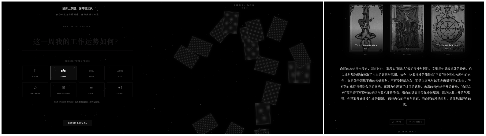

# F.Tarot

  
  
<em>A bilingual tarot app built around classic imagery, original meanings, and restrained AI assistance.</em>

## English

F.Tarot is a bilingual tarot app for both practitioners and enthusiasts.

If you are a tarot reader, you can use it as a digital card deck. If you are a learner or hobbyist, you can use its AI feature as a light interpretive aid.

The app includes original interpretations from *The Pictorial Key to the Tarot, by A.E. Waite, illustrated by Pamela Colman Smith [1911]*, together with high-quality cropped images of the original cards. The goal is to keep the experience close to the classic deck and its historical language, so that the images and meanings themselves remain the center of the reading.

F.Tarot is designed to encourage personal interpretation first. Please do not rely too heavily on AI. The built-in AI reading is intentionally brief and restrained. It is not meant to generate a long report or replace your own judgment. If you want to go further, you can continue in a conversational way: study the spread, then talk with AI around the cards, positions, symbols, and tensions in the layout.

## What F.Tarot Offers

- A digital tarot deck based on the classic Rider-Waite-Smith imagery
- Original card meanings and source material grounded in A.E. Waite's 1911 text
- High-quality cropped card images for close visual reading
- English and Simplified Chinese support
- A restrained AI reading mode for a short first pass
- An `Ask Deeper` flow that lets you continue the conversation in ChatGPT

## How To Use It

1. Choose a spread and draw the cards.
2. Read the cards yourself first.
3. Use the built-in interpretation as a concise companion, not a final authority.
4. If you want to explore further, use `Ask Deeper` and continue the reading as a dialogue.

## Live App

https://songhaifan.github.io/frank-tarot/

## Notes

- The app is configured for GitHub Pages under `/frank-tarot/`.
- If you run it locally with your own AI key, add `GEMINI_API_KEY=your_api_key_here` to `.env.local`.
- The source text and imagery referenced in this project are drawn from public-domain material published in 1911.

---

## 中文

F.Tarot 是一个中英双语的塔罗应用，既适合塔罗实践者，也适合爱好者。

如果你是塔罗牌命理师，可以把它当作电子卡牌来使用；如果你是爱好者，也可以借助其中的 AI 功能获得简短的辅助解读。

应用内提供了 *The Pictorial Key to the Tarot, by A.E. Waite, illustrated by Pamela Colman Smith [1911]* 的原版释义，以及原版高清裁剪的塔罗牌图片。这样做的目的，是尽可能使用最经典的图像与释义，让阅读的重心回到牌面本身，并鼓励我们先进行自己的理解与判断。

F.Tarot 不希望你过分依赖 AI。内置的 AI 解读功能是刻意克制和简略的，它不是为了生成一份冗长报告，更不是为了取代你自己的阅读。更适合的方式是：先看牌、先感受、先判断；如果你希望进一步解读，再以对话的形式围绕牌面、牌位、象征和彼此关系，与 AI 继续交流。

## F.Tarot 提供什么

- 基于经典 Rider-Waite-Smith 体系的电子塔罗牌组
- 来自 A.E. Waite 1911 原典的卡牌释义与参考内容
- 便于观察细节的原版高清裁剪牌面图片
- 中英双语支持
- 克制、简短的 AI 初步解读
- 可通过 `Ask Deeper` 继续在 ChatGPT 中展开对话式探索

## 使用建议

1. 选择牌阵并完成抽牌。
2. 先自己阅读牌面。
3. 把应用中的解读当作简洁辅助，而不是最终答案。
4. 如果想继续深挖，再通过 `Ask Deeper` 进入对话式交流。

## 在线体验

https://songhaifan.github.io/frank-tarot/

## 说明

- 当前 GitHub Pages 部署路径为 `/frank-tarot/`。
- 如果你要在本地启用 AI 功能，请在 `.env.local` 中添加 `GEMINI_API_KEY=your_api_key_here`。
- 项目中引用的原典文字与图像素材来自 1911 年出版、现已进入公有领域的资料。

## License

MIT
